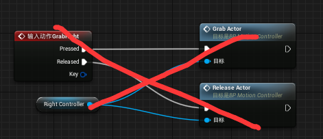
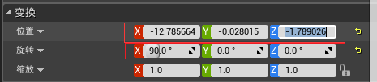

# UE4下的VR开发
-- 
author:longlongwaytogo  
link: 
[https://github.com/longlongwaytogo/UE4VRDemo/blob/gitHub_master/docs/VR%E5%BC%80%E5%8F%91.md]()     

---
本文主要通过一个案例，讲述UE4下使用HTC Vive设备，对VR项目的开发过程。

## 1.  开发准备：
**VR设备：** Htc Vive  
**软件：**  UE4.17   
 

## 2. 主要步骤：
- 使用UE4的VR模版创建VR工程
- 分离左右手柄
- 添加右手手柄
- 给右手绘制射线
- 导入fbx场景测试
- 对左手添加Navgation Mesh

---

###2.1. 使用UE4的VR模版创建VR工程
 - UE4本身包含有创建VR项目的template，可以通过该template创建VRDemo项目，如图：
 
- 对项目进行修改：     
删除startMap,配置启动map
  
打开：编辑->项目设置，找到"地图模式"选项，将Editor start map 修改为 MotionControllerMap。     
  
###2.2 分离左右手柄
打开资源浏览器，Content\VirtualRealityBP\Blueprints目录，如图：
  
选择蓝图MotionControllerPawn，并打开，删除右手RightController的相关操作。

  

  

   
 
  
 
现在，右手手柄已经不起作用了。
### 2.3 添加右手手柄
切换到Content\VirtualRealityBP\Blueprints目录，创建新的蓝图类(Actor类型)，命名为：RightController。
打开该蓝图，在组件栏添加MotionController组件，命名为：MotionController_R,并将Motion Controller的属性改为Right(绑定右手手柄)。再添加子节点skeletal Mesh,命名为：HandleMesh，HandleMesh下再添加Spline组件(是Utility中的spline,不是spline Mesh)，命名为：spline(用于后面绘制射线)，如图：
  
  
选中handleMesh,在其Detail属性面板中，设置Mesh为：MannequinHand_Right,在视口中即可看到手柄模型：
  
修改HandleMesh的偏移和旋转坐标为：(参考左手手柄)  
  
然后，在蓝图添加Hand变量，类型为：EController Hand:   
  
同时，需要对hand变量的属性作如下设置,以保证Hand变量可以在蓝图中显示：  
  
切换到MotionControllerPawn蓝图，找到RightController变量，修改其类型为：Right Controller的对象类型：
  
修改Create RightController的蓝图逻辑，关联RightController:  
  
此时，已经将左右手柄分离。

###2.4 给右手绘制射线
射线的绘制，需要用到spline组件来完成，具体的spline用法，可以参考：  
 [https://www.youtube.com/watch?v=MqPeFIEJUmg](https://www.youtube.com/watch?v=MqPeFIEJUmg)  
打开RitghtController蓝图的事件图表，添加允许接受手柄输入(**GetPlayer的输出做为EnableInput的PlayerController的输入，不要连接错了，否则无法触发事件**)：  
  
 添加TeleportRight事件，添加TracedEnable 布尔类型变量，设置spline的可视性。

添加ClearSpline函数：

添加Destanation变量为：Vector类型,绘制Teleport的主要逻辑：

添加射线求交逻辑：  

添加bHit为布尔型变量
添加SplineMesh为Spline commponent类型的变量数组:  
   
编写spline的计算逻辑，图太大了，分为两张：
   

完成以上蓝图，其工作量也不小，但是看不到射线，还有一个步骤要做，添加mesh:
可以通过3max制作一个Cylinder,导入UE中或使用系统的BeamMesh，并创建一个绿色材质：
   
spline Mesh 绑定模型：Cylinder

ok,启动看看：发现右手手柄可以求交，但射线显示错误：
  
怎么成了弯的了，应该是spline的法线有问题，果然，以下逻辑少了根连线：

经过修改后如下，但material无效：

找了半天也没有结果，明天接着查。
---
第二天：google了几个答案，这个链接比较靠谱：
[https://answers.unrealengine.com/questions/438758/material-wont-be-placed-on-spline.html](),
意思就是Material需要勾选"Used with Spline Meshes"选项，OK:  

测试了下，发现射线无法在未hit下显示,原来又有线连接错了：

###2.5导入fbx场景测试
自己可以导入外部fbx

###2.6对左手添加Navgation Mesh
导入新的fbx场景，需要手工添加Navgation Mesh，否则左手手柄无法求交。

---
Ok,总算完工了。